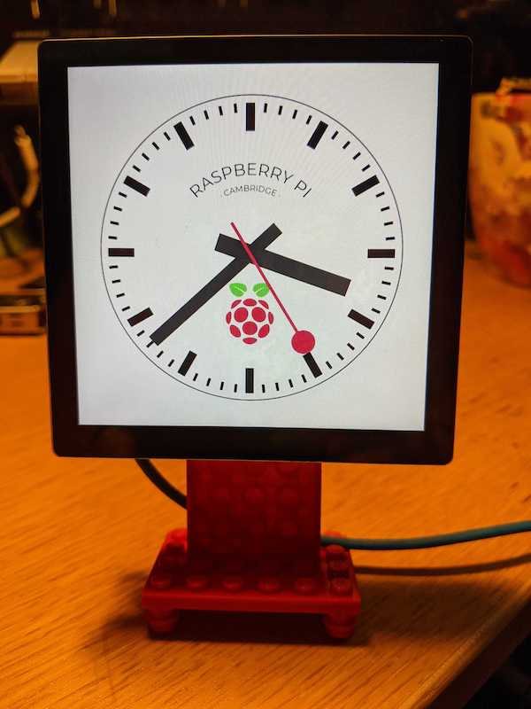

# Station Clock



I got a [HyperPixel](https://shop.pimoroni.com/products/hyperpixel-4-square?variant=30138251444307) ages ago but it wasn't suitable for the thing I wanted it for, so it's been sat in a drawer. I recently came across a [very lovely D3.js clock](https://www.danielpradilla.info/blog/a-swiss-railway-clock-in-d3/) and it gave me an idea.

This repo is mostly just a few bits of glue tbh, all the good stuff was created by other people.

## Software

This was all done on a pristine install of Raspberry Pi OS Lite (i.e. no desktop) via [NOOBS 3.5](https://www.raspberrypi.org/downloads/noobs/).

You'll need to use a proper screen for the install because the Hyperpixel won't work until you've installed the drivers.

After the first boot, you need to enable SSH:

```bash
sudo raspi-config
```

* `3 Interface Options`
  * `P2 SSH`
    * `Yes`

Once you've done this you should be able to get to the Pi with

```bash
ssh pi@raspberrypi.local
```

Presuming this works, power it off, and attach the Hyperpixel (or move the card to the Pi which has the Hyperpixel on it). When you boot it, the screen won't work, but we'll fix that in a minute.

### Install the screen drivers

SSH onto the Pi, and then, per [this](https://github.com/pimoroni/hyperpixel4):

```bash
curl https://get.pimoroni.com/hyperpixel4 | bash
```

Select the correct screen and Pi combination (in my case it's `3 : Weirdly Square - Pi 3B+ or older`) and let it do its thing. When it's done it will reboot, and the screen should work. Now

### Make it boot into Chromium

Per [this](https://blog.r0b.io/post/minimal-rpi-kiosk/) blogpost:

Install some stuff:

```bash
sudo apt-get update
sudo apt-get install \
  --no-install-recommends \
  --yes \
  xserver-xorg-video-all \
  xserver-xorg-input-all \
  xserver-xorg-core \
  xinit x11-xserver-utils \
  chromium-browser \
  unclutter \
  nginx
```

Start X on login:

```bash
cat << EOF > ~/.bash_profile
if [ -z $DISPLAY ] && [ \$(tty) = /dev/tty1 ]
then
  startx
fi
EOF
```

Run Chromium when X starts:

```bash
cat << EOF > ~/.xinitrc
#!/usr/bin/env sh

URL=http://localhost
SCREEN_SIZE=720

xset -dpms
xset s off
xset s noblank

unclutter &
chromium-browser \${URL} \\
  --window-size=\$SCREEN_SIZE},\$SCREEN_SIZE} \\
  --window-position=0,0 \\
  --start-fullscreen \\
  --kiosk \\
  --incognito \\
  --noerrdialogs \\
  --disable-translate \\
  --no-first-run \\
  --fast \\
  --fast-start \\
  --disable-infobars \\
  --disable-features=TranslateUI \\
  --disk-cache-dir=/dev/null \\
  --overscroll-history-navigation=0 \\
  --disable-pinch
EOF
```

And now make it auto-login:

```bash
sudo raspi-config
```

* 1 System Options
  * S5 Boot / Auto Login
    * B2 Console Autologin

> Note: there's presumably a way to script this, but `¯\_(ツ)_/¯`

### Enable the virtualhost

```bash
sudo ln -sf /home/pi/station-clock/nginx/site.conf /etc/nginx/sites-enabled/default
```

### Get and patch the clock js

```bash
git clone https://github.com/danielpradilla/d3clock
patch --verbose  --ignore-whitespace --unified d3clock/clock.html --input patches/clock.html.patch
patch --verbose  --ignore-whitespace --unified d3clock/d3clock.js --input patches/d3clock.js.patch
mkdir d3clock/assets
cp assets/images/raspberry.svg d3clock/assets
```

### (Optionally) disable the low-power warnings

```bash
echo "avoid_warnings=2" | sudo tee -a /boot/config.txt
```

### Reboot

```bash
sudo reboot
```

## Hardware

### Pi choice

I first tried this on a Pi Zero but its single-core absolutely could not handle the JavaScript animation: the sweeping second-hand was creaking and jerking, and it eventually ground to a complete halt when I left it running overnight. Right now I'm running it on Pi 3 A+, which seems to just-about keep up.

### Making the stand

Anybody remember [Nimuno Loops](https://twitter.com/nimunoloops?lang=en) (which I think maybe became [Mayka Tape](https://www.thetoyshop.com/lego-construction/building-blocks/Mayka-Tape---2-Stud-Dark-Green-2-Metres-By-ZURU/p/532182_Dgreen))? I have 4 boxes of this stuff from when I backed it on IndieGogo but I never found a use for it until now.

The screen is just about 10 Lego studs by 10 Lego studs, so with the Pi mounted, I worked out where I could attach some bits of the Nimuno, attached the Nimuno stud-side-up to a Lego scaffold to keep it all in the right place, and stuck it down.

I will take some pictures of this tomorrow.
